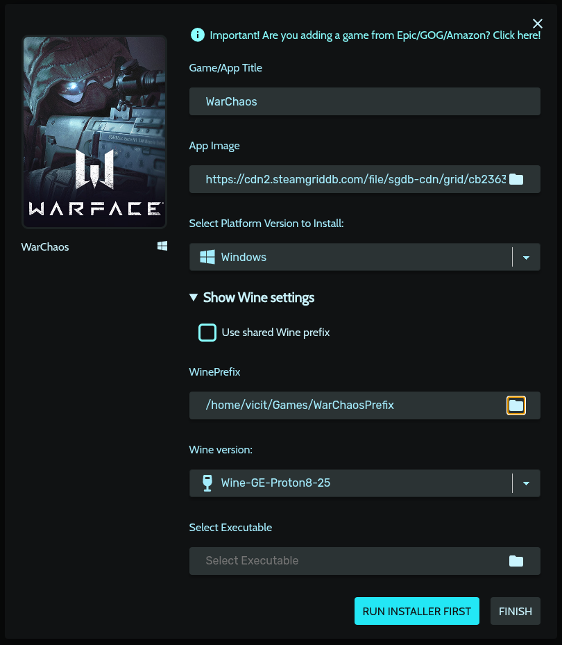
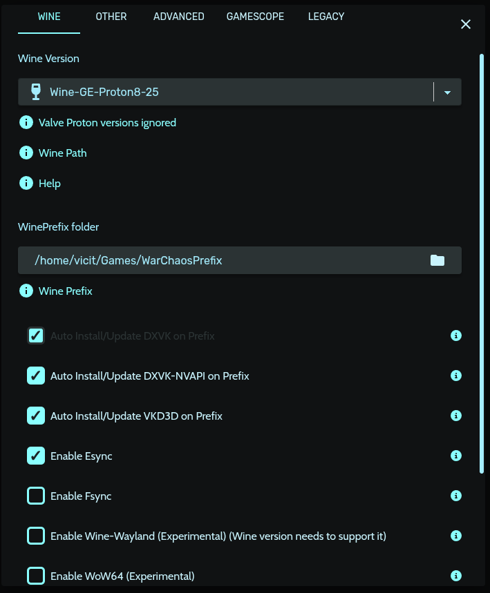
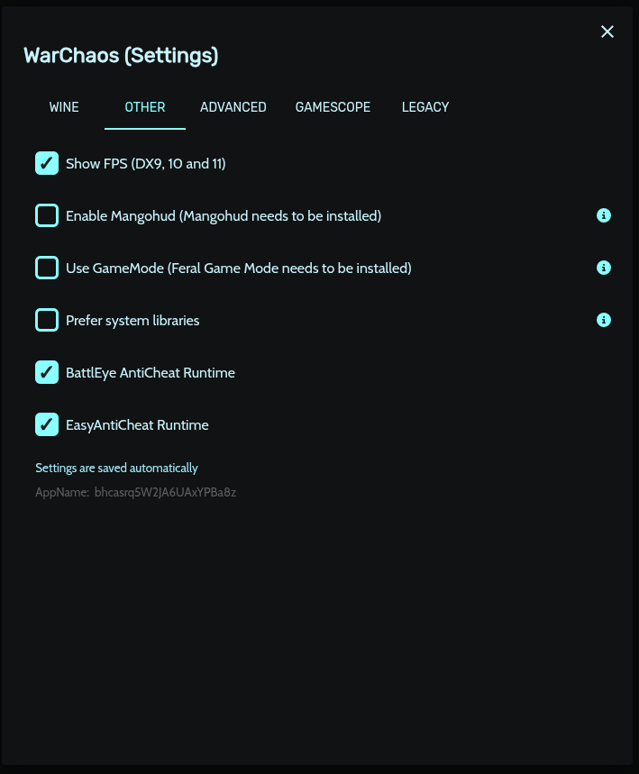
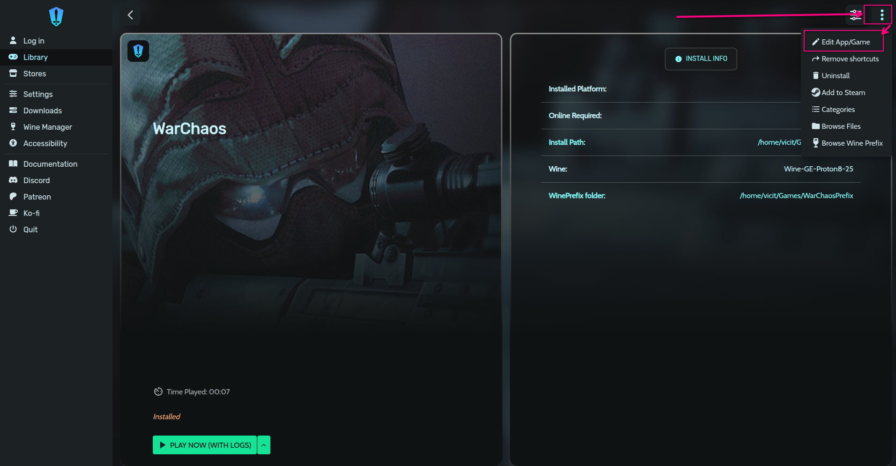
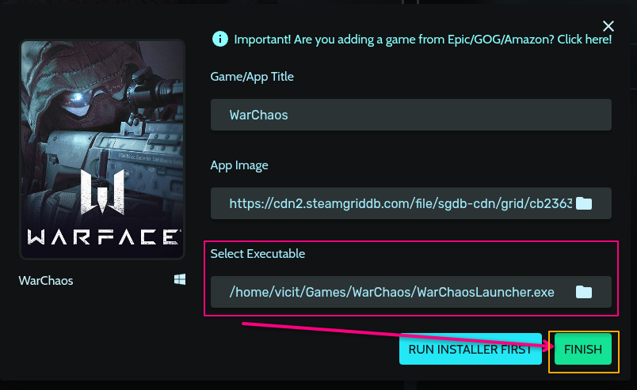

# 🐧 WarChaos no Linux (Heroic + Wine-GE + DXVK)

Guia completo para rodar WarChaos no Linux utilizando Heroic Games Launcher, Wine-GE e DXVK.

---

## ⚙️ Configuração Inicial

### **✅ Requisitos**

- [WarChaos](https://wf.warchaos.com.br/downloads) (atualizado)
- [Heroic Games Launcher](https://heroicgameslauncher.com/)
- [Wine-GE-Proton8-25](https://github.com/GloriousEggroll/wine-ge-custom/releases/) (ou superior)
- [Vulkan](https://www.vulkan.org/) (funcionando corretamente)
- Driver gráfico atualizado (Mesa RADV / NVIDIA proprietário)
- [.NET 8](https://builds.dotnet.microsoft.com/dotnet/WindowsDesktop/8.0.24/windowsdesktop-runtime-8.0.24-win-x64.exe) (ou superior)

> **⚠️ Importante:**
>
> A instalação do **WarChaos** no **Linux** foi testado via Lutris, Steam e Heroic, o que funcionou foi via Heroic mas quando preenchido todos os requisitos para o funcionamento correto do jogo com a melhor compatibilidade.
>
> Este guia foi feito com testes no **Arch Linux** então é importante que você faça a instalação e configuração seguindo o que a sua distro recomenda como nos guias abaixo
>
> <https://wiki.archlinux.org/title/gaming>
>
> <https://arch.d3sox.me/gaming/>

---

## 💾 Prefixo

### **📦 Criando um Prefixo Limpo (64-bit)**

- 1️⃣ Criar prefixo limpo
  Este comando cria um prefixo Wine limpo e 64 bits

  ```bash
    WINEPREFIX=~/Games/WarChaosPrefix WINEARCH=win64 wineboot
  ```

- 2️⃣ Instalar dependências
  Isso instala fontes e Visual C++ 2022

  ```bash
    WINEPREFIX=~/Games/WarChaosPrefix winetricks -q corefonts vcrun2022
  ```

- 3️⃣ Instalar .NET 8 Desktop
  Nessa etapa você primeiro precisa baixar o .exe do .NET, nesse momento o que usamos é a v8.0.24 mas se quando estiver lendo esse guia se você baixar uma versão superior e quiser testa é só mudar o nome do pacote no comando abaixo.

  > Lembre-se de rodar este comando na pasta onde você baixou o .exe do .NET

  ```bash
    WINEPREFIX=~/Games/WarChaosPrefix WINEDLLOVERRIDES="mscoree=" wine windowsdesktop-runtime-8.0.24-win-x64.exe
  ```

  > **⚠️ Importante:**
  >
  > O launcher exige .NET Desktop Runtime x64, não funciona em prefixo 32-bit.

## 🎮 Jogo no Heroic

### **Configuração no Heroic Launcher**

- 1️⃣ Criar novo jogo manual
  - Título: WarChaos
  - Imagem: <https://cdn2.steamgriddb.com/file/sgdb-cdn/grid/cb2363691a8351ee799c9108229c75b4.png>
  - Plataforma: Windows
  - Prefixo: /home/seu-usuario/Games/WarChaosPrefix
  - Wine Version: Wine-GE-Proton8-25

  

- 2️⃣ Rodar instalador primeiro
  - Clique em "Run Install First"
  - Selecione o executável do launcher WarChaosLauncher.exe ele vai está dentro da pasta "WarChaos" que você extrai do .zip que baixa no site do jogo.

  > **⚠️ Importante:**
  >
  > Deixe o launcher:
  >
  > - Atualizar
  > - Verificar arquivos
  > - Baixar dependências
  >
  > Depois que fizer isso ainda não entre no jogo, feche o launcher, e no Heroic clique em "Finish", o jogo já vai aparecer na sua biblioteca de jogos.

- 3️⃣ Configurações Importantes

  Abra as configurações do jogo:
  - Aba Wine:

    > ✅ Ativar:
    - Esync → ON
    - DXVK → ON
    - VKD3D → ON (Install/Update on prefix)

    > ❌ Desativar:
    - Fsync → OFF

    

  - Aba Outros:

    > ✅ Ativar:
    - Show FPS (opcional)
    - BattlEye AntiCheat (opcional)
    - Easy AntiCheat (opcional)

    

  - Aba Avançado:
    Desça até encontrar "Environment Variables" e adicione as seguintes:

    ```bash
      DXVK_ENABLE_NVAPI=0
      DXVK_LOG_LEVEL=none
    ```

    DXVK_ENABLE_NVAPI=0 - Evita conflitos NVAPI
    DXVK_LOG_LEVEL=none - Remove spam de logs

- 4️⃣ Executável final
  Por último você clica no jogo na biblioteca, vai no menu de 3 pontinhos e clica em "Edit Game" e em executável você seleciona o launcher WarChaosLauncher.exe.
  
  

---

## 🚀 Executando o Jogo

Agora é só da play e ser feliz, dentro do jogo é recomendado mexer nas configurações de gráfico para se encaixar ao seu hardware.

### **🧠 Observações Importantes**

- Prefixo precisa ser win64
- .NET Desktop Runtime precisa ser versão x64
- Wine padrão pode não funcionar — prefira Wine-GE
- Mesa antigo pode causar travamentos ao entrar na partida
- NVIDIA pode precisar driver proprietário atualizado

### **🧊 Problemas Conhecidos**

Jogo congela ao entrar na partida. Possíveis causas:

- DXVK não inicializado corretamente
- Vulkan mal configurado
- Problema com compilação de shaders
- Driver Mesa antigo
- Fsync Ativado

### **📁 Estrutura Recomendada**

```json
~/Games/
 ├── WarChaos/
 ├── WarChaosPrefix/
 └── windowsdesktop-runtime-8.0.xx-win-x64.exe
```

> **🏁 Status Atual**
>
> - ✔ Launcher funciona
> - ✔ Login funciona
> - ✔ Verificação de integridade OK
> - ✔ Jogo inicia
>
> ⚠ Importante: Pode congelar ao entrar na partida dependendo do driver Vulkan
>
> **🔥 Recomendações Extras**
>
> Se ainda houver travamentos:
>
> - Testar Proton Experimental
> - Testar Wine-GE mais recente
> - Desativar DXVK_ASYNC
> - Testar sem RADV_PERFTEST
> - Atualizar Mesa
